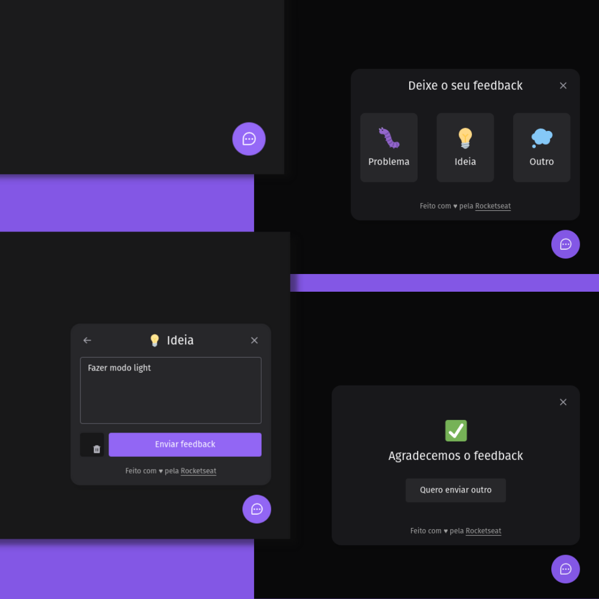

<h1 align="center">
  Feedback Widget
</h1>

<h3 align="center">
  🚀 NLW - Return Impulse
</h3>

  <a href="#rocket-tecnologias">Tecnologias</a>&nbsp;&nbsp;&nbsp;|&nbsp;&nbsp;&nbsp;
  <a href="#-projeto">Projeto</a>&nbsp;&nbsp;&nbsp;|&nbsp;&nbsp;&nbsp;
  <a href="#-layout">Layout</a>&nbsp;&nbsp;&nbsp;|&nbsp;&nbsp;&nbsp;
  <a href="#-execução">Execução</a>&nbsp;&nbsp;&nbsp;|&nbsp;&nbsp;&nbsp;
  <a href="#memo-licença">Licença</a>

 

  

## :rocket: Tecnologias

Esse projeto foi desenvolvido com as seguintes tecnologias:

- [Node.js](https://nodejs.org/en/)
- [React](https://reactjs.org)
- [Prisma](https://www.prisma.io/)
- [Tailwindcss](https://tailwindcss.com/)
- [Vercel](https://vercel.com)
- [Railway](https://railway.app/)

## 💻 Projeto

O Feedback Widget é um projeto que visa coletar feedbacks dos usuários da aplicação que o utiliza.

## 🔖 Layout

Você pode visualizar o layout do projeto no formato através [desse link](https://www.figma.com/community/file/1102912516166573468). Lembrando que você irá precisar ter uma conta no [Figma](http://figma.com/).

## 🤔 Execução

Você pode utilizar a aplicação por este [link](https://nlw-return-impulse-web-deborafantinif.vercel.app/).

## :memo: Licença

Esse projeto está sob a licença MIT. Veja o arquivo [LICENSE](LICENSE.md) para mais detalhes.

---
